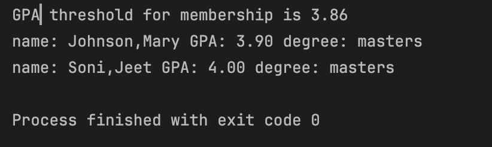

## Honor Society Eligibility System

**Author - Jeet Soni**

**Date - March 13, 2025**

---

### :pencil2: Description

Am I eligible for honor society membership? This program helps you with just that! :brain: I built a small 
program using OOPs to find out if a student is eligible for honor society or not. 

### :thinking: How does it work?

#### `Student` Class:
- Represents a **generic student** with:
    - `name`, `credit`, and `points` (quality points earned).
- Implements:
    - `gpa()` method to calculate GPA.
    - `eligibleForHonorSociety()` method to check if the student meets the threshold.
    - `setGpaThreshold()` to dynamically update eligibility criteria.

#### `Graduate` Class:
- Extends `Student` and adds a `degree` attribute.
- Ensures only **Master's students** can qualify for honor society.
- Overrides `eligibleForHonorSociety()` to check both **GPA** and **degree type**.

#### `Undergraduate` Class:
- Extends `Student` and adds a `year` attribute (Freshman, Sophomore, Junior, Senior).
- Ensures only **Junior and Senior** students can qualify.
- Overrides `eligibleForHonorSociety()` to check both **GPA** and **year level**.

#### `Main` Class:
- Reads **student data** from `students.txt`.
- **Parses** and creates `Graduate` or `Undergraduate` objects dynamically.
- Computes **average GPA** and sets the **GPA threshold**
- finally, displays the eligible student

### :mag_right: Well, Show me

Made with :heart: by Jeet Soni

